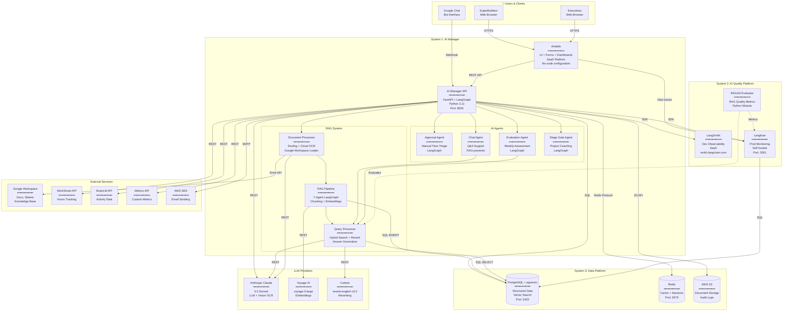

# C4 Level 2: Complete Container Architecture

**Date:** November 16, 2024  
**Status:** Final - Implementation-Ready  
**Purpose:** All containers across all 3 systems with RAG integration

---

## 🏗️ Complete Architecture Diagram



---

## 📦 Container Catalog

### **System 1: AI Manager (7 Containers)**

| Container | Technology | Deployment | Port | Purpose |
|-----------|------------|------------|------|---------|
| **Airtable** | SaaS | Cloud | 443 | UI + Workflows |
| **AI Manager API** | FastAPI | Self-hosted | 8000 | Core logic |
| **Document Processor** | Docling | Module | N/A | Parse docs |
| **RAG Pipeline** | LangGraph | Module | N/A | Chunking + embeddings |
| **Query Processor** | LangGraph | Module | N/A | Search + generate |
| **Approval Agent** | LangGraph | Module | N/A | Time approval |
| **Evaluation Agent** | LangGraph | Module | N/A | Weekly assessment |
| **Chat Agent** | LangGraph | Module | N/A | Q&A support |
| **Stage Gate Agent** | LangGraph | Module | N/A | Project coaching |

### **System 2: AI Quality Platform (3 Containers)**

| Container | Technology | Deployment | Port | Purpose |
|-----------|------------|------------|------|---------|
| **LangSmith** | SaaS | Cloud | 443 | Dev tracing |
| **Langfuse** | Docker | Self-hosted | 3001 | Prod monitoring |
| **RAGAS Evaluator** | Python | Module | N/A | Quality metrics |

### **System 3: Data Platform (3 Containers)**

| Container | Technology | Deployment | Port | Purpose |
|-----------|------------|------------|------|---------|
| **PostgreSQL + pgvector** | PostgreSQL 15 | Docker | 5432 | Primary database |
| **Redis** | Redis 7 | Docker | 6379 | Cache + sessions |
| **AWS S3** | SaaS | Cloud | 443 | Document storage |

### **External Services (8 Containers)**

| Service | Provider | Purpose | Protocol |
|---------|----------|---------|----------|
| **Google Workspace** | Google | Document source | Drive/Docs/Sheets API |
| **WorkSmart** | Crossover | Hours tracking | REST API |
| **BrainLift** | Crossover | Activity data | REST API |
| **Metrics API** | Custom | Performance metrics | REST API |
| **AWS SES** | AWS | Email sending | SMTP |
| **Anthropic Claude** | Anthropic | LLM + Vision OCR | REST API |
| **Voyage AI** | Voyage | Embeddings | REST API |
| **Cohere** | Cohere | Reranking | REST API |

---

## 🔄 Key Interactions

### **1. Document Ingestion Flow**

```
Google Drive (Docs/Sheets)
    ↓ Google Drive API (HTTPS)
Document Processor (Google Workspace Loader)
    ↓ In-memory
Document Processor (Docling)
    ↓ In-memory (if scanned)
Document Processor (Cloud OCR - Claude Vision)
    ↓ Anthropic API (HTTPS)
RAG Pipeline (Smart Chunker)
    ↓ In-memory
RAG Pipeline (Embedding Engine)
    ↓ Voyage API (HTTPS)
PostgreSQL (pgvector)
    ↓ SQL INSERT
[Stored for retrieval]
```

### **2. Query & Answer Flow**

```
User (via Airtable)
    ↓ HTTPS
AI Manager API
    ↓ In-memory
Query Processor (Query Analyzer)
    ↓ Claude API (HTTPS)
Query Processor (Embedding Engine)
    ↓ Voyage API (HTTPS)
Query Processor (Hybrid Retriever)
    ↓ SQL SELECT (hybrid_search function)
PostgreSQL (pgvector + FTS)
    ↓ Result set
Query Processor (Reranker - optional)
    ↓ Cohere API (HTTPS)
Query Processor (Answer Generator)
    ↓ Claude API (HTTPS)
AI Manager API
    ↓ HTTPS
User (Answer + Citations)
```

### **3. Approval Workflow**

```
SuperBuilder (Airtable form)
    ↓ Airtable Automation (Webhook)
AI Manager API (/approvals/triage)
    ↓ In-memory
Approval Agent (LangGraph)
    ├→ Query Processor (check policies via RAG)
    ├→ WorkSmart API (get hours)
    └→ BrainLift API (get activity)
    ↓ Decision logic
PostgreSQL (save decision)
    ↓ If low confidence
Executive (Airtable notification)
    ↓ Manual review
AI Manager API (/approvals/decide)
    ↓ SQL UPDATE
PostgreSQL (final decision)
    ↓ Email
AWS SES → SuperBuilder
```

### **4. Weekly Evaluation Flow**

```
Airtable (Scheduled automation - Monday 9 AM)
    ↓ Webhook
AI Manager API (/evaluations/weekly)
    ↓ For each SuperBuilder
Evaluation Agent (LangGraph)
    ├→ PostgreSQL (get projects)
    ├→ Query Processor (get grading criteria via RAG)
    ├→ WorkSmart API (get hours)
    ├→ BrainLift API (get activity)
    ├→ Metrics API (get peer reviews)
    └→ Claude API (evaluate + generate feedback)
    ↓ Grades + Feedback
PostgreSQL (save evaluation)
    ↓ Email template
AWS SES → SuperBuilder
    ↓ Trace
Langfuse (monitoring)
```

---

## 🎯 Container Responsibilities

### **Document Processor Container:**
- ✅ Download from Google Drive
- ✅ Parse all formats (Excel, PDF, Word, etc.)
- ✅ OCR for scanned documents
- ✅ Extract tables and structure
- ✅ Output: Raw text + metadata

### **RAG Pipeline Container:**
- ✅ Smart chunking (semantic boundaries)
- ✅ Create embeddings (Voyage/OpenAI)
- ✅ Store in pgvector
- ✅ Maintain indexes
- ✅ Output: Searchable vectors

### **Query Processor Container:**
- ✅ Analyze query intent
- ✅ Optimize retrieval strategy
- ✅ Hybrid search (vector + keyword)
- ✅ Rerank results (optional)
- ✅ Generate answers with citations
- ✅ Output: Answer + confidence + sources

### **AI Agents Containers:**
- ✅ Use Query Processor for context
- ✅ Call external APIs for data
- ✅ Apply business logic
- ✅ Make decisions
- ✅ Generate outputs
- ✅ Output: Decisions + feedback

---

## 📋 API Keys Required (Complete List)

### **MUST HAVE:**
1. ✅ `OPENAI_API_KEY` OR `ANTHROPIC_API_KEY`
2. ✅ `VOYAGE_API_KEY` (or use OpenAI for embeddings)

### **SHOULD HAVE:**
3. ✅ `LANGSMITH_API_KEY` (development)
4. ✅ `LANGFUSE_PUBLIC_KEY` + `LANGFUSE_SECRET_KEY` (production)

### **OPTIONAL:**
5. `COHERE_API_KEY` (reranking)
6. `MISTRAL_API_KEY` or `GEMINI_API_KEY` (alternative OCR)
7. Google Service Account JSON (for Google Drive automation)

---

## ✅ Level 2 Complete

**Containers Defined:** 19 total
- 9 in AI Manager
- 3 in AI Quality Platform
- 3 in Data Platform
- 8 External Services

**Technology Choices:** Finalized
**Data Flows:** Documented
**Interactions:** Specified
**Costs:** Estimated (~$15/month)
**Performance:** Characterized (2-5 sec latency)

**Ready for Level 3 (Components)?** 🚀

