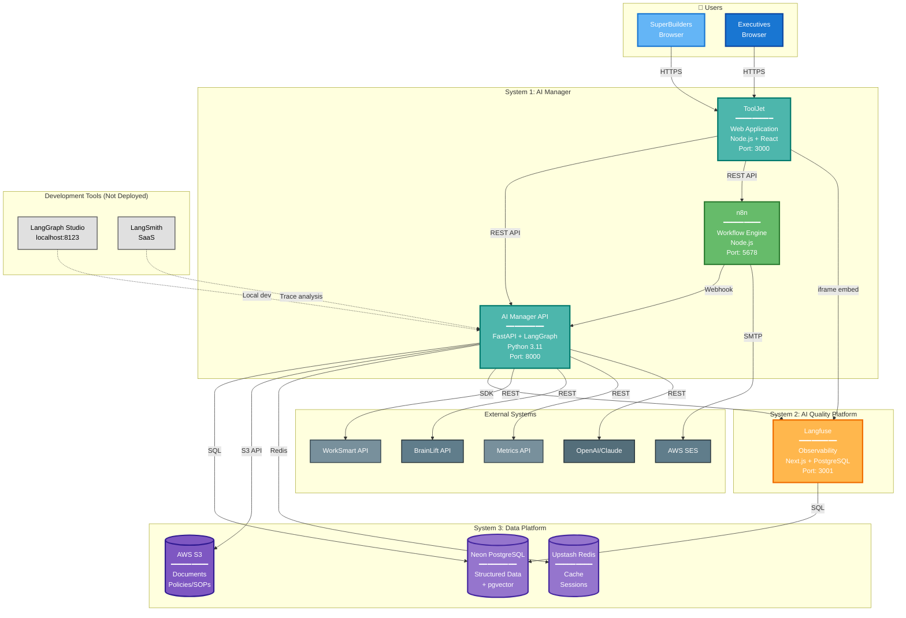
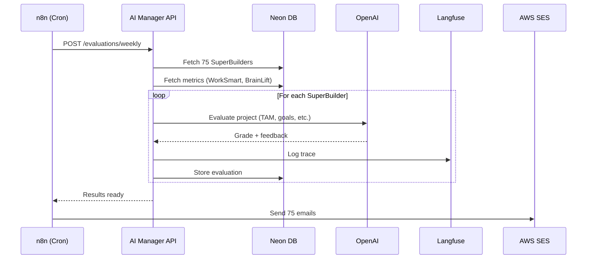
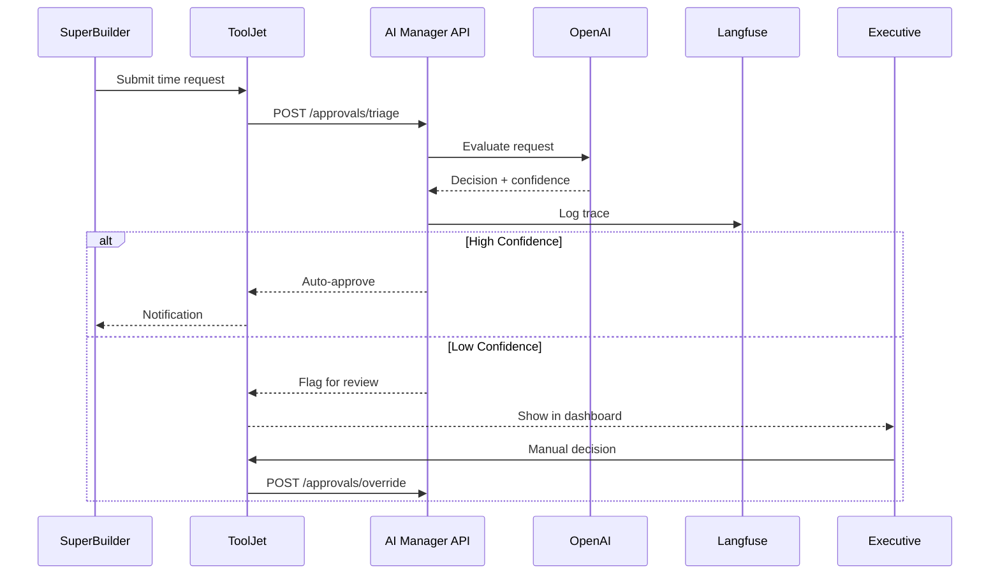
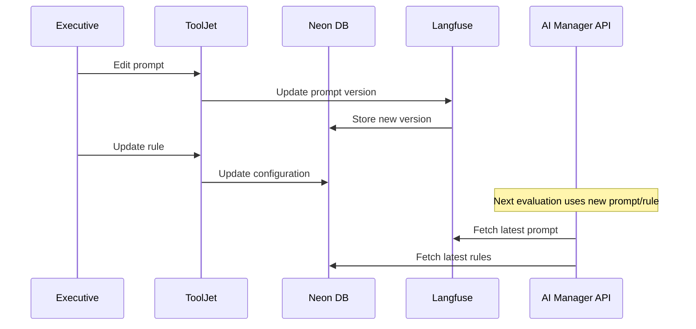

# C4 Level 2: Container Architecture

**Date:** November 14, 2024  
**Status:** Draft  
**Purpose:** Define the deployable containers and their interactions

---

## 📦 What is C4 Level 2 (Containers)?

**Level 2 zooms into each system** from Level 1 and shows:
- **Deployable units** (containers, services, applications)
- **Technology choices** for each container
- **Data stores** used by each container
- **Communication protocols** between containers
- **Deployment boundaries**

**NOT included at this level:**
- Internal code structure (that's Level 3: Components)
- Specific classes/functions (that's Level 4: Code)

---

## 🎯 The 3 Systems from Level 1

From C4 Level 1, we have:
1. **AI Manager** (102 features)
2. **AI Quality Platform** (43 features)
3. **Data Platform** (26 features)

Now we break each into **deployable containers**.

---

## 🏗️ Container Architecture Overview



---

## 📦 Container Specifications

### **Container 1: ToolJet Web Application**

```yaml
Name: tooljet-app
Technology: Node.js 18+ / React
Purpose: All user interfaces (Executive + SuperBuilder)
Port: 3000
Deployment: Docker container on ECS Fargate

Features:
  Executive UI:
    - Configure prompts, rules, policies
    - Review quality (embedded Langfuse)
    - Approval dashboards
    - Performance reports
  
  SuperBuilder UI:
    - Submit manual time requests
    - View performance (optional)
    - Access via "My SuperBase" interface

Database: ToolJet Internal PostgreSQL (included)
  Contains:
    - UI configurations
    - Dashboard layouts
    - User preferences

Environment Variables:
  - TOOLJET_HOST
  - DATABASE_URL (internal)
  - API_ENDPOINT (AI Manager API)
  - N8N_WEBHOOK_URL
  - LANGFUSE_URL (for iframe embed)

Scaling: 1-2 instances (low traffic)
```

---

### **Container 2: n8n Workflow Engine**

```yaml
Name: n8n-workflows
Technology: Node.js 18+
Purpose: Business workflow orchestration
Port: 5678
Deployment: Docker container on ECS Fargate

Workflows:
  - Weekly evaluation trigger (Monday 9am)
  - Email generation and sending
  - API orchestration (multi-step)
  - Webhook receivers
  - Scheduled jobs (daily, weekly, monthly)

Database: Shares Neon PostgreSQL
  Contains:
    - Workflow definitions
    - Execution history
    - Credentials (encrypted)

Environment Variables:
  - N8N_HOST
  - DATABASE_URL (Neon)
  - AI_API_URL
  - AWS_SES_CREDENTIALS
  - WEBHOOK_SECRET

Scaling: 1 instance (cron jobs don't scale horizontally)
```

---

### **Container 3: AI Manager API (FastAPI + LangGraph)**

```yaml
Name: ai-manager-api
Technology: Python 3.11 / FastAPI / LangGraph
Purpose: AI orchestration and decision logic
Port: 8000
Deployment: AWS Lambda (serverless) OR ECS Fargate

Endpoints:
  /evaluations/weekly:
    - Process 75 SuperBuilders
    - Grade 97 projects
    - Return results
  
  /approvals/triage:
    - AI decision on manual time request
    - Return: approve/reject + confidence + reasoning
  
  /chat/query:
    - Q&A support
    - Retrieve from vector DB
    - Generate response
  
  /stage-gates/evaluate:
    - Check progression criteria
    - Return: can_progress + feedback
  
  /prompts/optimize:
    - Self-improvement loop
    - Analyze failures
    - Suggest prompt improvements

Database Connections:
  - Neon PostgreSQL (structured data + pgvector)
  - S3 (document retrieval)
  - Redis (caching)

External APIs:
  - OpenAI/Claude (LLM)
  - Voyage-3-Large (embeddings)
  - WorkSmart, BrainLift, Metrics

Observability:
  - Langfuse SDK (trace logging)

Environment Variables:
  - DATABASE_URL
  - OPENAI_API_KEY
  - ANTHROPIC_API_KEY
  - VOYAGE_API_KEY
  - LANGFUSE_PUBLIC_KEY
  - LANGFUSE_SECRET_KEY
  - WORKSMART_API_KEY
  - BRAINLIFT_API_KEY
  - S3_BUCKET_NAME
  - REDIS_URL

Scaling: 
  - Lambda: Auto-scale 0-10 concurrent
  - ECS: 2-5 instances with auto-scaling
```

---

### **Container 4: Langfuse Observability**

```yaml
Name: langfuse-observability
Technology: Next.js 14 / PostgreSQL
Purpose: AI trace logging, prompt management, quality metrics
Port: 3001
Deployment: Docker container on ECS Fargate

Features:
  - Trace visualization (every AI interaction)
  - Prompt version management
  - Quality metrics dashboard
  - Human review interface
  - A/B testing results
  - Cost tracking

Database: Shares Neon PostgreSQL
  Tables:
    - traces
    - prompts
    - evaluations
    - feedback

Environment Variables:
  - NEXTAUTH_URL
  - DATABASE_URL (Neon)
  - NEXTAUTH_SECRET

Access:
  - Embedded in ToolJet (iframe)
  - Direct URL for developers

Scaling: 1-2 instances
```

---

### **Data Store 1: Neon PostgreSQL**

```yaml
Service: Neon (Serverless PostgreSQL)
Version: PostgreSQL 16
Extensions: pgvector
Purpose: Primary data store

Databases:
  ai_manager_production:
    Tables:
      # Structured Data
      - superbuilders (profiles, status)
      - projects (details, stages, history)
      - metrics (weekly data)
      - evaluations (AI assessments)
      - approvals (decisions, reasoning)
      - pips (performance plans)
      
      # Vector Data (pgvector)
      - policy_embeddings (1536 dimensions)
      - conversation_embeddings (512 dimensions)
      
      # ToolJet Internal
      - tooljet_* (UI configs)
      
      # n8n Internal
      - n8n_* (workflows)
      
      # Langfuse Internal
      - langfuse_* (traces, prompts)

Connections:
  - ToolJet: Read/write UI data
  - n8n: Read/write workflows
  - AI Manager API: Read/write all data
  - Langfuse: Read/write traces

Backup: Automated daily snapshots
Security: SSL, IP whitelist, IAM roles
```

---

### **Data Store 2: AWS S3**

```yaml
Service: AWS S3
Purpose: Unstructured document storage

Buckets:
  ai-manager-policies:
    - policies/ (PDF, DOCX)
    - sops/ (markdown, PDF)
    - rubrics/ (JSON, PDF)
    - templates/ (HTML email templates)
  
  ai-manager-audit:
    - logs/ (application logs)
    - exports/ (data exports)
    - backups/ (database dumps)

Access:
  - AI Manager API: Read policies for RAG
  - ToolJet: Upload/download via API
  - Langfuse: Store large traces

Lifecycle:
  - Policies: No expiration
  - Logs: 90 days retention
  - Backups: 30 days retention
```

---

### **Data Store 3: Upstash Redis**

```yaml
Service: Upstash Redis (Serverless)
Purpose: Caching and session storage

Data Types:
  Cache:
    - API responses (TTL: 5 min)
    - Evaluation results (TTL: 1 hour)
    - Vector search results (TTL: 15 min)
  
  Sessions:
    - User sessions (TTL: 24 hours)
    - Rate limiting counters (TTL: 1 hour)
    - Temporary computation results

Access:
  - AI Manager API: Primary user
  - ToolJet: Session storage

Scaling: Serverless (auto-scale)
```

---

## 🔄 Key Interactions

### **1. Weekly Evaluation Flow**



### **2. Manual Time Approval Flow**



### **3. Executive Configuration Flow**



---

## 🌐 Deployment Architecture

### **Option A: Serverless-First (Recommended)**

```yaml
Containers (ECS Fargate):
  - ToolJet: 1-2 tasks (always running)
  - n8n: 1 task (always running)
  - Langfuse: 1 task (always running)

Serverless (Lambda):
  - AI Manager API: On-demand (0-10 concurrent)
  
Databases (Serverless):
  - Neon PostgreSQL: Auto-scale
  - Upstash Redis: Auto-scale
  - S3: Unlimited

Cost: ~$400-800/month
Scaling: Automatic
Maintenance: Low
```

### **Option B: All Containers**

```yaml
Containers (ECS Fargate):
  - ToolJet: 1-2 tasks
  - n8n: 1 task
  - Langfuse: 1 task
  - AI Manager API: 2-5 tasks (with ALB)

Databases (Serverless):
  - Neon PostgreSQL: Auto-scale
  - Upstash Redis: Auto-scale
  - S3: Unlimited

Cost: ~$600-1,200/month
Scaling: Manual/Auto-scaling groups
Maintenance: Medium
```

---

## 🔐 Security & Authentication

### **Authentication Flow:**

```yaml
ToolJet:
  Method: Built-in authentication + SSO
  Users:
    - Executives: Full access
    - SuperBuilders: Limited access
    - Developers: Admin access
  
  Optional: AWS Cognito integration

API Authentication:
  Method: API Keys + JWT
  Keys:
    - ToolJet: Service API key
    - n8n: Service API key
    - Langfuse: SDK keys

External APIs:
  - WorkSmart: API key (per user)
  - BrainLift: Lambda API key
  - OpenAI: Organization API key
  - Voyage: API key
```

---

## 📊 Data Flow Patterns

### **1. Read-Heavy Operations (Q&A, Dashboards)**

```
User → ToolJet → Redis (check cache)
                ↓ (cache miss)
                → API → Neon DB + pgvector
                      → LLM (if needed)
                → Redis (store result)
                → ToolJet → User
```

### **2. Write-Heavy Operations (Weekly Evaluations)**

```
n8n (trigger) → API → Batch process
                     → Neon DB (bulk insert)
                     → Langfuse (async logging)
                     → n8n (completion webhook)
                     → AWS SES (send emails)
```

### **3. Real-Time Operations (Chat)**

```
User → ToolJet → API → pgvector (semantic search)
                     → LLM (generate response)
                     → Langfuse (log trace)
                     → ToolJet → User

Latency target: < 2 seconds
```

---

## 🎯 Technology Choices Summary

| Container | Technology | Why This Choice |
|-----------|-----------|-----------------|
| **ToolJet** | Node.js + React | Open source, self-hosted, executive-friendly UI |
| **n8n** | Node.js | Visual workflows, extensive integrations, self-hosted |
| **AI Manager API** | Python + FastAPI + LangGraph | LangGraph for AI orchestration, FastAPI for performance |
| **Langfuse** | Next.js + PostgreSQL | Open source observability, self-hosted, embeddable |
| **Neon** | PostgreSQL 16 + pgvector | Serverless, vector search, cost-effective |
| **S3** | Object storage | Standard for documents, cheap, reliable |
| **Redis** | Upstash (serverless) | Caching, no maintenance, pay-per-use |
| **LLM** | OpenAI + Claude | Best quality, fallback redundancy |
| **Embeddings** | Voyage-3-Large | SOTA performance, 32K context |

---

## 🚀 Deployment Strategy

### **Phase 1: Core Infrastructure (Week 1)**
```bash
1. Provision Neon PostgreSQL
2. Create S3 buckets
3. Set up Upstash Redis
4. Configure AWS SES
```

### **Phase 2: Deploy Containers (Week 2)**
```bash
1. Deploy ToolJet (ECS)
2. Deploy n8n (ECS)
3. Deploy Langfuse (ECS)
4. Configure networking (VPC, security groups)
```

### **Phase 3: Deploy AI Layer (Week 3)**
```bash
1. Package FastAPI + LangGraph
2. Deploy to Lambda OR ECS
3. Configure API Gateway
4. Test end-to-end
```

### **Phase 4: Integration (Week 4)**
```bash
1. Connect ToolJet → API
2. Configure n8n workflows
3. Embed Langfuse in ToolJet
4. Test with real data
```

---

## 📈 Monitoring & Operations

### **Health Checks:**

```yaml
ToolJet:
  Endpoint: GET /api/health
  Interval: 30 seconds
  
n8n:
  Endpoint: GET /healthz
  Interval: 30 seconds
  
AI Manager API:
  Endpoint: GET /health
  Interval: 30 seconds
  
Langfuse:
  Endpoint: GET /api/health
  Interval: 30 seconds
```

### **Observability:**

```yaml
Application Logs:
  - CloudWatch Logs (all containers)
  - Retention: 30 days
  
Metrics:
  - CloudWatch Metrics (CPU, memory, requests)
  - Custom metrics via Langfuse
  
Traces:
  - All AI interactions → Langfuse
  - API calls → CloudWatch X-Ray (optional)
  
Alerts:
  - Container health failures
  - API error rate > 5%
  - Langfuse quality metrics < threshold
```

---

## 💰 Cost Breakdown

```yaml
Compute (ECS Fargate):
  ToolJet: 0.25 vCPU, 0.5 GB RAM = $15/month
  n8n: 0.25 vCPU, 0.5 GB RAM = $15/month
  Langfuse: 0.25 vCPU, 0.5 GB RAM = $15/month
  AI API (if ECS): 0.5 vCPU, 1 GB RAM × 2 = $60/month
  Subtotal: $105/month

OR Lambda:
  AI API: ~$50-150/month (usage-based)

Databases:
  Neon PostgreSQL: $25-50/month
  Upstash Redis: $10-30/month
  S3: $5-20/month
  Subtotal: $40-100/month

External Services:
  OpenAI API: $200-500/month
  Voyage API: $20-50/month
  AWS SES: $10-50/month
  LangSmith (dev): $99/month
  Subtotal: $329-699/month

Networking:
  ALB: $20/month
  Data transfer: $10-30/month
  Subtotal: $30-50/month

Total: $504-1,104/month
```

---

## ✅ Next Steps

This Container Architecture provides:
- ✅ Clear deployment boundaries
- ✅ Technology choices justified
- ✅ Scalability strategy
- ✅ Cost estimates
- ✅ Integration patterns

**Ready for Level 3 (Component Architecture)?**
- Zoom into each container
- Show internal components
- Define interfaces and responsibilities

