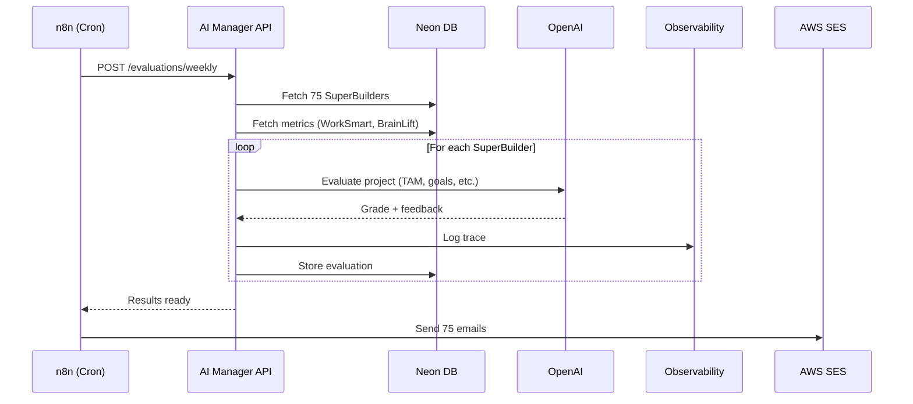
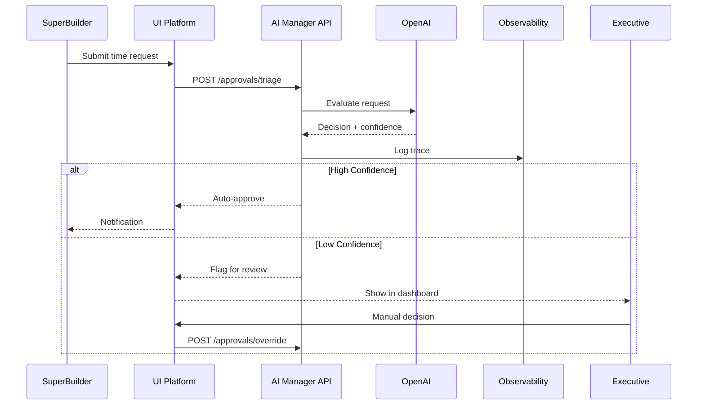

# C4 Level 2: Container Architecture

**Date:** November 14, 2024  
**Status:** Draft  
**Purpose:** Define the deployable containers and their interactions

---

## 📦 What is C4 Level 2 (Containers)?

**Level 2 zooms into each system** from Level 1 and shows:
- **Deployable units** (containers, services, applications)
- **Technology choices** for each container
- **Data stores** used by each container
- **Communication protocols** between containers
- **Deployment boundaries**

**NOT included at this level:**
- Internal code structure (that's Level 3: Components)
- Specific classes/functions (that's Level 4: Code)

---

## 🎯 The 3 Systems from Level 1

From C4 Level 1, we have:
1. **AI Manager** (102 features)
2. **AI Quality Platform** (43 features)
3. **Data Platform** (26 features)

Now we break each into **deployable containers**.

---

## 🏗️ Container Architecture Overview

```mermaid
graph TB
    subgraph "👥 Users"
        SB[SuperBuilders<br/>Browser]
        EXEC[Executives<br/>Browser]
    end
    
    subgraph "System 1: AI Manager"
        UI[Web Application<br/>━━━━━━━━━<br/>UI Platform<br/>TBD: Airtable or ToolJet<br/>Port: 3000]
        
        WORKFLOW[n8n<br/>━━━━━━━━━<br/>Workflow Engine<br/>Node.js<br/>Port: 5678]
        
        API[AI Manager API<br/>━━━━━━━━━<br/>FastAPI + LangGraph<br/>Python 3.11<br/>Port: 8000]
    end
    
    subgraph "System 2: AI Quality Platform"
        OBS[Observability Platform<br/>━━━━━━━━━<br/>TBD: LangSmith or Langfuse<br/>Port: 3001]
    end
    
    subgraph "System 3: Data Platform"
        NEON[(Neon PostgreSQL<br/>━━━━━━━━━<br/>Structured Data<br/>+ pgvector)]
        
        S3[(AWS S3<br/>━━━━━━━━━<br/>Documents<br/>Policies/SOPs)]
        
        REDIS[(Upstash Redis<br/>━━━━━━━━━<br/>Cache<br/>Sessions)]
    end
    
    subgraph "External Systems"
        WS[WorkSmart API]
        BL[BrainLift API]
        METRICS[Metrics API]
        LLM[OpenAI/Claude]
        SES[AWS SES]
    end
    
    subgraph "Development Tools (Not Deployed)"
        STUDIO[LangGraph Studio<br/>localhost:8123]
        SMITH[LangSmith<br/>SaaS]
    end
    
    %% User interactions
    SB -->|HTTPS| UI
    EXEC -->|HTTPS| UI
    
    %% Container interactions
    UI -->|REST API| API
    UI -->|REST API| WORKFLOW
    UI -->|View/Embed| OBS
    
    WORKFLOW -->|Webhook| API
    WORKFLOW -->|SMTP| SES
    
    API -->|SQL| NEON
    API -->|S3 API| S3
    API -->|Redis| REDIS
    API -->|SDK| OBS
    
    OBS -->|SQL| NEON
    
    %% External integrations
    API -->|REST| WS
    API -->|REST| BL
    API -->|REST| METRICS
    API -->|REST| LLM
    
    %% Development
    STUDIO -.->|Local dev| API
    SMITH -.->|Trace analysis| API
    
    %% Styling
    style UI fill:#4db6ac,stroke:#00796b,stroke-width:3px,color:#fff
    style WORKFLOW fill:#66bb6a,stroke:#2e7d32,stroke-width:3px,color:#fff
    style API fill:#4db6ac,stroke:#00796b,stroke-width:3px,color:#fff
    
    style OBS fill:#ffb74d,stroke:#ef6c00,stroke-width:3px,color:#fff
    
    style NEON fill:#9575cd,stroke:#4527a0,stroke-width:3px,color:#fff
    style S3 fill:#7e57c2,stroke:#311b92,stroke-width:3px,color:#fff
    style REDIS fill:#9575cd,stroke:#4527a0,stroke-width:3px,color:#fff
    
    style WS fill:#78909c,stroke:#37474f,stroke-width:2px,color:#fff
    style BL fill:#607d8b,stroke:#263238,stroke-width:2px,color:#fff
    style METRICS fill:#78909c,stroke:#37474f,stroke-width:2px,color:#fff
    style LLM fill:#546e7a,stroke:#263238,stroke-width:2px,color:#fff
    style SES fill:#607d8b,stroke:#263238,stroke-width:2px,color:#fff
    
    style STUDIO fill:#e0e0e0,stroke:#616161,stroke-width:2px,color:#000
    style SMITH fill:#e0e0e0,stroke:#616161,stroke-width:2px,color:#000
    
    style SB fill:#64b5f6,stroke:#1976d2,stroke-width:3px,color:#fff
    style EXEC fill:#1976d2,stroke:#0d47a1,stroke-width:3px,color:#fff
```



---

## 📦 Container Specifications

### **Container 1: Web Application (UI Platform)**

**Decision Pending:** Airtable (SaaS) vs ToolJet (Self-hosted)

#### **Option A: Airtable (SaaS)**

```yaml
Service: Airtable
Technology: SaaS Platform
Purpose: All user interfaces (Executive + SuperBuilder)
Deployment: Cloud (managed by Airtable)

Features:
  Executive UI:
    - Configure rules, policies
    - Approval dashboards
    - Performance reports
    - (Observability in separate tab)
  
  SuperBuilder UI:
    - Submit manual time requests
    - View/update projects
    - "My SuperBase" interface (Itamar's POC)

Database: Airtable Base
  Contains:
    - SuperBuilder profiles
    - Projects & history
    - Approval requests
    - Configuration data

Integration:
  - REST API to AI Manager API
  - Webhooks from Airtable Automations
  - Cannot embed observability tools

Cost: $45/user/month × 3 = $135/month
Pros: Fast (POC exists), familiar to Itamar
Cons: Can't embed observability, SaaS only, ongoing cost
```

#### **Option B: ToolJet (Self-hosted)**

```yaml
Name: tooljet-app
Technology: Node.js 18+ / React
Purpose: All user interfaces (Executive + SuperBuilder)
Port: 3000
Deployment: Docker container on ECS Fargate

Features:
  Executive UI:
    - Configure prompts, rules, policies
    - Review quality (embedded observability)
    - Approval dashboards
    - Performance reports
  
  SuperBuilder UI:
    - Submit manual time requests
    - View performance (optional)
    - Access via "My SuperBase" interface

Database: ToolJet Internal PostgreSQL (included)
  Contains:
    - UI configurations
    - Dashboard layouts
    - User preferences

Environment Variables:
  - TOOLJET_HOST
  - DATABASE_URL (internal)
  - API_ENDPOINT (AI Manager API)
  - N8N_WEBHOOK_URL
  - OBSERVABILITY_URL (for iframe embed)

Cost: $15/month (compute only)
Pros: $0 licensing, embed observability, self-hosted
Cons: Need to build what Airtable POC already has (2-3 weeks)

Scaling: 1-2 instances (low traffic)
```

**Recommendation:** See `research-and-analysis/AIRTABLE_VS_TOOLJET.md` for detailed comparison

---

### **Container 2: n8n Workflow Engine**

```yaml
Name: n8n-workflows
Technology: Node.js 18+
Purpose: Business workflow orchestration
Port: 5678
Deployment: Docker container on ECS Fargate

Workflows:
  - Weekly evaluation trigger (Monday 9am)
  - Email generation and sending
  - API orchestration (multi-step)
  - Webhook receivers
  - Scheduled jobs (daily, weekly, monthly)

Database: Shares Neon PostgreSQL
  Contains:
    - Workflow definitions
    - Execution history
    - Credentials (encrypted)

Environment Variables:
  - N8N_HOST
  - DATABASE_URL (Neon)
  - AI_API_URL
  - AWS_SES_CREDENTIALS
  - WEBHOOK_SECRET

Scaling: 1 instance (cron jobs don't scale horizontally)
```

---

### **Container 3: AI Manager API (FastAPI + LangGraph)**

```yaml
Name: ai-manager-api
Technology: Python 3.11 / FastAPI / LangGraph
Purpose: AI orchestration and decision logic
Port: 8000
Deployment: AWS Lambda (serverless) OR ECS Fargate

Endpoints:
  /evaluations/weekly:
    - Process 75 SuperBuilders
    - Grade 97 projects
    - Return results
  
  /approvals/triage:
    - AI decision on manual time request
    - Return: approve/reject + confidence + reasoning
  
  /chat/query:
    - Q&A support
    - Retrieve from vector DB
    - Generate response
  
  /stage-gates/evaluate:
    - Check progression criteria
    - Return: can_progress + feedback
  
  /prompts/optimize:
    - Self-improvement loop
    - Analyze failures
    - Suggest prompt improvements

Database Connections:
  - Neon PostgreSQL (structured data + pgvector)
  - S3 (document retrieval)
  - Redis (caching)

External APIs:
  - OpenAI/Claude (LLM)
  - Voyage-3-Large (embeddings)
  - WorkSmart, BrainLift, Metrics

Observability:
  - LangSmith SDK OR Langfuse SDK (trace logging)

Environment Variables:
  - DATABASE_URL
  - OPENAI_API_KEY
  - ANTHROPIC_API_KEY
  - VOYAGE_API_KEY
  - OBSERVABILITY_PUBLIC_KEY (LangSmith or Langfuse)
  - OBSERVABILITY_SECRET_KEY (LangSmith or Langfuse)
  - WORKSMART_API_KEY
  - BRAINLIFT_API_KEY
  - S3_BUCKET_NAME
  - REDIS_URL

Scaling: 
  - Lambda: Auto-scale 0-10 concurrent
  - ECS: 2-5 instances with auto-scaling
```

---

### **Container 4: Observability Platform**

**Decision Pending:** LangSmith vs Langfuse vs Both

#### **Option A: LangSmith (SaaS)**

```yaml
Service: LangSmith
Technology: SaaS Platform (LangChain)
Purpose: AI trace logging, prompt management, quality metrics
Deployment: Cloud (managed)

Features:
  - Native LangGraph integration
  - LangGraph Studio (visual debugging)
  - Trace visualization
  - Prompt management
  - Evaluation datasets
  - Team collaboration

Database: Managed by LangSmith

Access:
  - Web UI (separate tab or embedded?)
  - SDK integration in Python

Cost: $199/month (team plan, 5 users)
Pros: Native LangGraph, Studio included, simple setup
Cons: Ongoing cost, vendor lock-in, embedding unclear
```

#### **Option B: Langfuse (Self-hosted)**

```yaml
Name: langfuse-observability
Technology: Next.js 14 / PostgreSQL
Purpose: AI trace logging, prompt management, quality metrics
Port: 3001
Deployment: Docker container on ECS Fargate

Features:
  - Trace visualization (every AI interaction)
  - Prompt version management
  - Quality metrics dashboard
  - Human review interface
  - A/B testing results
  - Cost tracking

Database: Shares Neon PostgreSQL
  Tables:
    - traces
    - prompts
    - evaluations
    - feedback

Environment Variables:
  - NEXTAUTH_URL
  - DATABASE_URL (Neon)
  - NEXTAUTH_SECRET

Access:
  - Embedded in UI platform (iframe confirmed)
  - Direct URL for developers

Cost: $15/month (compute only)
Pros: $0 licensing, open source, embeddable, full control
Cons: Less native LangGraph integration, no visual Studio

Scaling: 1-2 instances
```

#### **Option C: Both (Hybrid)**

```yaml
Development:
  - LangSmith Cloud: $39/month (1 developer)
  - LangGraph Studio included
  - Patrick uses for debugging

Production:
  - Langfuse Self-hosted: $15/month (compute)
  - Embedded in UI for executives
  - Production traces

Total Cost: $54/month
Pros: Best of both worlds
Cons: Slight complexity (two tools)
```

**Recommendation:** See `research-and-analysis/OBSERVABILITY_STACK.md` for detailed analysis

---

### **Data Store 1: Neon PostgreSQL**

```yaml
Service: Neon (Serverless PostgreSQL)
Version: PostgreSQL 16
Extensions: pgvector
Purpose: Primary data store

Databases:
  ai_manager_production:
    Tables:
      # Structured Data
      - superbuilders (profiles, status)
      - projects (details, stages, history)
      - metrics (weekly data)
      - evaluations (AI assessments)
      - approvals (decisions, reasoning)
      - pips (performance plans)
      
      # Vector Data (pgvector)
      - policy_embeddings (1536 dimensions)
      - conversation_embeddings (512 dimensions)
      
      # UI Platform Internal (if self-hosted)
      - ui_platform_* (configs, if ToolJet)
      
      # n8n Internal
      - n8n_* (workflows)
      
      # Observability Internal (if self-hosted)
      - observability_* (traces, prompts, if Langfuse)

Connections:
  - UI Platform: Read/write application data
  - n8n: Read/write workflows
  - AI Manager API: Read/write all data
  - Observability: Read/write traces

Backup: Automated daily snapshots
Security: SSL, IP whitelist, IAM roles
```

---

### **Data Store 2: AWS S3**

```yaml
Service: AWS S3
Purpose: Unstructured document storage

Buckets:
  ai-manager-policies:
    - policies/ (PDF, DOCX)
    - sops/ (markdown, PDF)
    - rubrics/ (JSON, PDF)
    - templates/ (HTML email templates)
  
  ai-manager-audit:
    - logs/ (application logs)
    - exports/ (data exports)
    - backups/ (database dumps)

Access:
  - AI Manager API: Read policies for RAG
  - UI Platform: Upload/download via API
  - Observability: Store large traces

Lifecycle:
  - Policies: No expiration
  - Logs: 90 days retention
  - Backups: 30 days retention
```

---

### **Data Store 3: Upstash Redis**

```yaml
Service: Upstash Redis (Serverless)
Purpose: Caching and session storage

Data Types:
  Cache:
    - API responses (TTL: 5 min)
    - Evaluation results (TTL: 1 hour)
    - Vector search results (TTL: 15 min)
  
  Sessions:
    - User sessions (TTL: 24 hours)
    - Rate limiting counters (TTL: 1 hour)
    - Temporary computation results

Access:
  - AI Manager API: Primary user
  - UI Platform: Session storage (if applicable)

Scaling: Serverless (auto-scale)
```

---

## 🔄 Key Interactions

### **1. Weekly Evaluation Flow**



### **2. Manual Time Approval Flow**



### **3. Executive Configuration Flow**


---

## 🌐 Deployment Architecture

### **Option A: Serverless-First (Recommended)**

```yaml
Containers (ECS Fargate):
  - ToolJet: 1-2 tasks (always running)
  - n8n: 1 task (always running)
  - Langfuse: 1 task (always running)

Serverless (Lambda):
  - AI Manager API: On-demand (0-10 concurrent)
  
Databases (Serverless):
  - Neon PostgreSQL: Auto-scale
  - Upstash Redis: Auto-scale
  - S3: Unlimited

Cost: ~$400-800/month
Scaling: Automatic
Maintenance: Low
```

### **Option B: All Containers**

```yaml
Containers (ECS Fargate):
  - ToolJet: 1-2 tasks
  - n8n: 1 task
  - Langfuse: 1 task
  - AI Manager API: 2-5 tasks (with ALB)

Databases (Serverless):
  - Neon PostgreSQL: Auto-scale
  - Upstash Redis: Auto-scale
  - S3: Unlimited

Cost: ~$600-1,200/month
Scaling: Manual/Auto-scaling groups
Maintenance: Medium
```

---

## 🔐 Security & Authentication

### **Authentication Flow:**

```yaml
ToolJet:
  Method: Built-in authentication + SSO
  Users:
    - Executives: Full access
    - SuperBuilders: Limited access
    - Developers: Admin access
  
  Optional: AWS Cognito integration

API Authentication:
  Method: API Keys + JWT
  Keys:
    - ToolJet: Service API key
    - n8n: Service API key
    - Langfuse: SDK keys

External APIs:
  - WorkSmart: API key (per user)
  - BrainLift: Lambda API key
  - OpenAI: Organization API key
  - Voyage: API key
```

---

## 📊 Data Flow Patterns

### **1. Read-Heavy Operations (Q&A, Dashboards)**

```
User → UI Platform → Redis (check cache)
                   ↓ (cache miss)
                   → API → Neon DB + pgvector
                         → LLM (if needed)
                   → Redis (store result)
                   → UI Platform → User
```

### **2. Write-Heavy Operations (Weekly Evaluations)**

```
n8n (trigger) → API → Batch process
                     → Neon DB (bulk insert)
                     → Observability (async logging)
                     → n8n (completion webhook)
                     → AWS SES (send emails)
```

### **3. Real-Time Operations (Chat)**

```
User → UI Platform → API → pgvector (semantic search)
                         → LLM (generate response)
                         → Observability (log trace)
                         → UI Platform → User

Latency target: < 2 seconds
```

---

## 🎯 Technology Choices Summary

| Container | Technology Options | Decision Status |
|-----------|-------------------|-----------------|
| **UI Platform** | Airtable (SaaS) OR ToolJet (self-hosted) | ⏳ Pending |
| **Workflow Engine** | n8n (Node.js, self-hosted) | ✅ Confirmed |
| **AI Manager API** | Python + FastAPI + LangGraph | ✅ Confirmed |
| **Observability** | LangSmith (SaaS) OR Langfuse (self-hosted) OR Both | ⏳ Pending |
| **Primary Database** | Neon PostgreSQL 16 + pgvector | ✅ Confirmed |
| **Document Storage** | AWS S3 | ✅ Confirmed |
| **Cache** | Upstash Redis (serverless) | ✅ Confirmed |
| **LLM** | OpenAI + Claude (fallback) | ✅ Confirmed |
| **Embeddings** | Voyage-3-Large | ✅ Confirmed |

---

## 🚀 Deployment Strategy

### **Phase 1: Core Infrastructure (Week 1)**
```bash
1. Provision Neon PostgreSQL
2. Create S3 buckets
3. Set up Upstash Redis
4. Configure AWS SES
```

### **Phase 2: Deploy Core Services (Week 2)**
```bash
1. Deploy n8n (ECS)
2. Deploy Observability platform (ECS or SaaS)
3. Configure networking (VPC, security groups)
```

### **Phase 3: Deploy AI Layer (Week 3)**
```bash
1. Package FastAPI + LangGraph
2. Deploy to Lambda OR ECS
3. Configure API Gateway
4. Test end-to-end
```

### **Phase 4: Deploy UI & Integration (Week 4+)**
```bash
Option A (Airtable):
  1. Use Itamar's POC as starting point
  2. Connect to AI Manager API
  3. Configure Airtable Automations
  4. Test with real data
  
Option B (ToolJet):
  1. Deploy ToolJet (ECS)
  2. Build interfaces (2-3 weeks)
  3. Embed observability
  4. Test with real data
```

---

## 📈 Monitoring & Operations

### **Health Checks:**

```yaml
UI Platform:
  Airtable: N/A (SaaS managed)
  ToolJet: GET /api/health (30s interval)
  
n8n:
  Endpoint: GET /healthz
  Interval: 30 seconds
  
AI Manager API:
  Endpoint: GET /health
  Interval: 30 seconds
  
Observability:
  LangSmith: N/A (SaaS managed)
  Langfuse: GET /api/health (30s interval)
```

### **Observability:**

```yaml
Application Logs:
  - CloudWatch Logs (all containers)
  - Retention: 30 days
  
Metrics:
  - CloudWatch Metrics (CPU, memory, requests)
  - Custom metrics via Langfuse
  
Traces:
  - All AI interactions → Observability platform
  - API calls → CloudWatch X-Ray (optional)
  
Alerts:
  - Container health failures
  - API error rate > 5%
  - AI quality metrics < threshold
```

---

## 💰 Cost Breakdown

```yaml
Compute (ECS Fargate):
  n8n: 0.25 vCPU, 0.5 GB RAM = $15/month
  AI API (if ECS): 0.5 vCPU, 1 GB RAM × 2 = $60/month
  
  UI Platform:
    Option A (Airtable): $135/month (3 users)
    Option B (ToolJet): $15/month (compute)
  
  Observability:
    Option A (LangSmith): $199/month (team) or $39/month (1 dev)
    Option B (Langfuse): $15/month (compute)
    Option C (Both): $54/month ($39 + $15)
  
  Subtotal: $90-225/month (varies by choices)

OR Lambda:
  AI API: ~$50-150/month (usage-based)

Databases:
  Neon PostgreSQL: $25-50/month
  Upstash Redis: $10-30/month
  S3: $5-20/month
  Subtotal: $40-100/month

External Services:
  OpenAI API: $200-500/month
  Voyage API: $20-50/month
  AWS SES: $10-50/month
  Subtotal: $230-600/month

Networking:
  ALB: $20/month
  Data transfer: $10-30/month
  Subtotal: $30-50/month

Total Range:
  Low (Airtable + Langfuse): ~$495/month
  Mid (ToolJet + Both observability): ~$430/month  
  High (ToolJet + LangSmith team): ~$619/month
```

---

## ✅ Status & Next Steps

### **What's Defined:**
- ✅ Container breakdown (4 containers + 3 data stores)
- ✅ Core technology stack (n8n, FastAPI+LangGraph, Neon, S3, Redis)
- ✅ Deployment patterns (serverless-first)
- ✅ Integration flows
- ✅ Cost ranges

### **Pending Decisions:**

1. **UI Platform:**
   - Option A: Airtable (leverage Itamar's POC, $135/month)
   - Option B: ToolJet (self-hosted, $15/month)
   - See: `research-and-analysis/AIRTABLE_VS_TOOLJET.md`

2. **Observability:**
   - Option A: LangSmith only ($39-199/month)
   - Option B: Langfuse only ($15/month)
   - Option C: Both ($54/month)
   - See: `research-and-analysis/OBSERVABILITY_STACK.md`

### **After Decisions Made:**
- Update this document with final choices
- Create Level 2 summary
- Move to Level 3: Component Architecture

### **Detailed Specifications:**
- UI mockups and flows: `research-and-analysis/INTERFACES.md`
- Platform comparisons: See research-and-analysis folder
