# C4 Level 1: System Context - AI Manager v2

**Date:** November 14, 2024  
**Level:** System Context  
**Approach:** Feature-driven architecture based on validated requirements

---

## 🎯 Executive Summary

AI Manager v2 consists of **3 core systems** that work together to manage 75+ SuperBuilders:

1. **AI Manager** - The automated manager that does what managers do
2. **AI Quality Platform** - Ensures AI makes good decisions  
3. **Data Platform** - Stores and manages all information

---

## 👥 Users

### **Primary Users**
- **75+ SuperBuilders** - Entrepreneurs building companies
- **Executives** - Non-technical leaders (Itamar, Joe) who manage and optimize the system
  - Need autonomy to modify system behavior without developer involvement
  - Receive monthly reports and make strategic decisions

### **Secondary Users**
- **Project Leads** - Review team performance
- **HR Admin** - Execute HR processes
- **External Reviewers** - Assess BrainLift quality

---

## 🎨 The 3 Core Systems

```mermaid
graph TB
    subgraph Users
        SB[SuperBuilders<br/>75+ entrepreneurs]
        EXEC[Executives<br/>Itamar, Joe]
    end
    
    subgraph "AI Manager v2"
        subgraph "System 1: AI Manager"
            PERF[Performance Management<br/>• Metrics collection<br/>• Weekly assessments<br/>• Rankings]
            COACH[Coaching & Feedback<br/>• Weekly emails<br/>• Q&A support<br/>• Proactive outreach]
            APPR[Approvals & Workflows<br/>• Manual time<br/>• Projects<br/>• Camera toggle<br/>• PIPs]
            ADMIN[HR Administration<br/>• Onboarding<br/>• Offboarding<br/>• Team management]
        end
        
        subgraph "System 2: AI Quality Platform"
            OBS[Observability<br/>• Trace all decisions<br/>• Track performance<br/>• Error monitoring]
            EVAL[Evaluation<br/>• 6 RAG metrics<br/>• Quality scoring<br/>• Dataset management]
            IMP[Improvement<br/>• Human review<br/>• Prompt optimization<br/>• Self-learning]
        end
        
        subgraph "System 3: Data Platform"
            STRUCT[Structured Data<br/>• SuperBuilder profiles<br/>• Projects & metrics<br/>• Workflow states]
            UNSTRUCT[Unstructured Data<br/>• Policies & SOPs<br/>• Knowledge base<br/>• Documentation]
        end
    end
    
    subgraph "External Systems"
        WS[WorkSmart API<br/>Time tracking]
        BL[BrainLift API<br/>Learning data]
        METRICS[Metrics API<br/>Pluggable metrics]
        AI[AI Provider<br/>OpenAI/Claude]
        EMAIL[Email/Chat<br/>Communications]
    end
    
    %% User interactions
    SB -->|Submit requests| APPR
    SB -->|Receive coaching| COACH
    SB -->|Track performance| PERF
    
    PA -->|Review quality| OBS
    PA -->|Approve exceptions| APPR
    PA -->|Monitor system| ADMIN
    
    IG -->|Configure prompts| IMP
    IG -->|Define rules| STRUCT
    IG -->|Update policies| UNSTRUCT
    
    JOE -->|Receive reports| PERF
    
    %% External integrations
    PERF <--> WS
    PERF <--> BL
    PERF <--> TW
    COACH <--> AI
    COACH <--> EMAIL
    APPR <--> WS
    
    %% Internal dependencies
    PERF --> STRUCT
    COACH --> UNSTRUCT
    APPR --> STRUCT
    OBS --> EVAL
    EVAL --> IMP
    
    style SB fill:#e1f5fe
    style PA fill:#e1f5fe
    style IG fill:#e1f5fe
    style JOE fill:#e1f5fe
    style WS fill:#f5f5f5
    style BL fill:#f5f5f5
    style TW fill:#f5f5f5
    style AI fill:#f5f5f5
    style EMAIL fill:#f5f5f5
```

---

## 📊 System Descriptions

### **System 1: AI Manager**

**Purpose:** Automated manager for the SuperBuilder team

**Core Features:**
- **Performance Management** (33 features)
  - Weekly metrics collection (WorkSmart, BrainLift, configurable metrics)
  - Project assessment (TAM, one-liner, SPOV, goals, achievements)
  - Personal score calculation and rankings
  - Production readiness verification

- **Coaching & Feedback** (20 features)
  - Weekly personalized performance emails
  - Q&A help desk with AI responses
  - Proactive coaching based on triggers

- **Approvals & Workflows** (29 features)
  - Manual time approval with AI triage
  - Project approval workflow
  - Stage gate management (S0→S1→S2→Production)
  - Camera toggle automation
  - Bounty eligibility

- **HR Administration** (20 features)
  - PIP management
  - Onboarding/offboarding
  - Team lead stack ranking

**Users:** SuperBuilders (primary), Executives (admin)

---

### **System 2: AI Quality Platform**

**Purpose:** Ensure AI Manager makes good decisions

**Core Features:**
- **Observability** (8 features)
  - Log every AI interaction
  - Track prompt versions
  - Record confidence scores
  - Capture user feedback
  - Monitor latency and costs

- **Human Review** (9 features)
  - View all AI outputs
  - Filter by confidence
  - Rate quality (1-5 scale)
  - Provide corrections
  - Tag for training

- **Prompt Management** (8 features)
  - Central prompt registry
  - Version control
  - UI-based editing (for Itamar)
  - A/B testing
  - Performance tracking

- **Evaluation** (11 features)
  - 6 RAG evaluation metrics
  - Production dataset creation
  - Quality benchmarking

- **Self-Improvement** (7 features)
  - Automatic trace collection
  - Low-quality flagging
  - Human review workflow
  - Continuous retraining

**Users:** Executives (quality review & prompt editing), System (automated)

---

### **System 3: Data Platform**

**Purpose:** Store and manage all information

**Core Features:**
- **Structured Data Management**
  - SuperBuilder profiles and teams
  - Project records and stages
  - Performance metrics history
  - Workflow states
  - Configuration settings

- **Unstructured Data Management**
  - Policies and procedures
  - SOPs and guidelines
  - Grading rubrics
  - Training materials
  - Document version control

- **Access Capabilities**
  - UI for non-technical users
  - API for system integration
  - Search and retrieval
  - Audit trails

**Users:** All systems (data layer), Executives (configuration & admin)

---

## 🔗 External Integrations

### **Must-Have Integrations**

| System | Purpose | Used By |
|--------|---------|---------|
| **WorkSmart API** | Time tracking, manual requests | AI Manager |
| **BrainLift API** | Learning minutes and content | AI Manager |
| **Metrics API** | Pluggable evaluation metrics | AI Manager |
| **AI Provider** | LLM for evaluation/generation | AI Manager, Quality |
| **Email/Chat** | Communication delivery | AI Manager |

---

## 🚀 Implementation Approach

### **Phase 1: Foundation (Weeks 1-4)**
1. **Data Platform** - Establish data layer
2. **Basic AI Manager** - Core approval workflows
3. **Minimal Quality** - Basic observability

### **Phase 2: Full Features (Weeks 5-8)**
4. **Complete AI Manager** - All features
5. **Quality Platform** - Human review + prompts
6. **Migration** - Move from Google Sheets

### **Phase 3: Optimization (Weeks 9-12)**
7. **Self-Improvement** - Learning loops
8. **Advanced Analytics** - Executive dashboards
9. **Scale Testing** - Performance optimization

---

## ✅ Success Metrics

- **Reduce admin time** from 10+ hours to <2 hours/week
- **AI accuracy** >95% with human oversight
- **SuperBuilder satisfaction** >80%
- **System uptime** >99.9%
- **Executive autonomy** - Can operate without developer assistance

---

## 📋 Next Steps

1. Review and approve this feature-based system structure
2. Proceed to simplified architectural decisions
3. Create detailed Level 2 container diagrams

This clean, feature-driven approach provides clarity on what we're building and why.